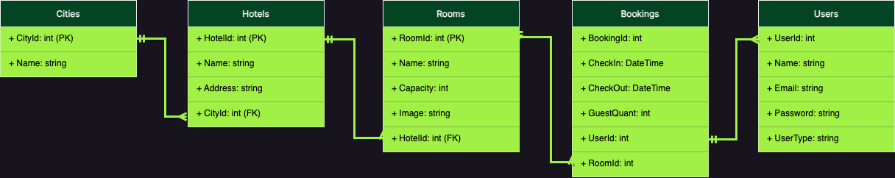

# Projeto Trybe Hotel

# Sobre o projeto

Esse é um projeto BackEnd desenvolvido utilizando a linguagem Csharp.

- Foi utilizado a linguegem `C#`. Minha participação esta composta na pasta _/src/TrybeHotel_ e _/src/TrybeHotel.Test_, os demais arquivos foram desenvovidos pela Trybe.

A API Trybe-Hotel foi desenvolvido para facilitar a realização de cadastros e reservas de hotel.

## Modelo conceitual


# Tecnologias utilizadas
## Back end
* Arquitetura em camadas
* Teste em camadas
* ORM - `Entity Framework`
* Banco de dados realacional - `SQL Server`
* Conteinerização - `Docker`
* Atenticação - `JWT`

# Como executar o projeto

Este projeto roda com o Docker então sera necessario apenas alguns comandos para rodar a aplicação com containers:

```bash
# clonar repositório
git clone git@github.com:FabricioAnastacio/projeto-trybe-hotel-csharp.git

# entrar na pasta do projeto
cd projeto-trybe-hotel-csharp

# inicie o container com o banco de dados
docker compose up -d --build

# va ate a pasta principal do projeto e atualize o banco de dados
cd src/TrybeHotel && dotnet ef database update

# inicie a API
dotnet run
```
Feito isso a API ja vai estar rodando na porta 5000 ou 5001. Podara acessa-la pelo link http://localhost:5000/ || http://localhost:5001/

*Para fechar a API é simples:*

```bash
# no terminal pressione 'ctrl + c' para fechar a API
# volte a pasta raiz onde se encontra o arquivo Docker-compose
docker compose down
```

# Autor

#### Fabricio Anastacio Rodrigues

[](https://www.linkedin.com/in/far-dev/)